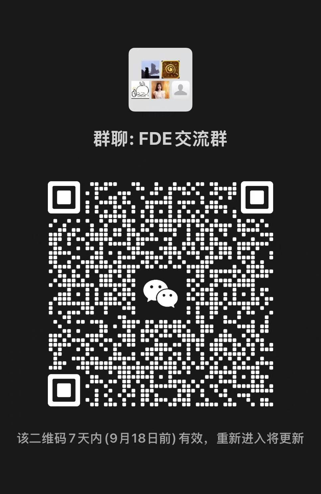

# 中国企业 FDE AI 项目合作计划

我们正在建立一个面向中国大陆企业 AI 落地项目的 Forward Deployed Engineer（FDE，前沿部署工程师）合作网络。

当前服务范围以中国大陆企业客户为主，合作机会以中文沟通、国内远程协作、国内出差和中国大陆现场交付为主，暂不面向海外派遣项目。

## 我们在解决什么问题

很多企业已经拥有模型、数据或 AI 产品，但在真实业务中仍会遇到数据接入、系统联调、权限、部署、培训和跨部门推进等问题。我们希望与有工程能力、业务理解和客户交付经验的伙伴合作，把 AI 从原型推进到可验收结果。

## 正在寻找的伙伴

- AI 应用工程师：RAG、Agent、LLM 应用、工作流自动化
- 解决方案/实施工程师：能理解业务并推进上线
- 平台与部署工程师：Docker、Kubernetes、API、监控、数据连接
- 技术顾问或项目负责人：能完成客户沟通、方案拆解和交付管理

## 合作方式

支持项目制、兼职顾问、短期外派和长期合作。每个项目单独确认目标、周期、地点、交付物、费用和验收标准；不要求先加入全职团队。

## 我们看重什么

- 有可展示的代码、产品或交付案例
- 能把模糊需求拆成技术方案、计划和验收指标
- 能和非技术客户沟通并管理预期
- 重视文档、风险反馈、数据安全和承诺兑现
- 能使用中文与国内企业客户沟通，熟悉企业微信、钉钉或飞书协作优先
- 有中国大陆企业客户实施、售前、培训或现场交付经验优先

## 如何参与

请先阅读 [合作指南](collaboration-guide.md)，再通过 GitHub Issue 提交申请，或在 Discussions 中发起合作交流。不要在 Issue 中提交身份证、客户机密、密码或其他敏感资料。

## 报名入口

[提交 FDE 合作申请](https://github.com/May5151/fde-ai-project-collaboration/issues/new/choose)

## FDE 国内交流

欢迎加入 FDE 交流微信群，讨论国内企业 AI 落地、RAG、Agent、部署和交付合作。二维码有效期至 2026 年 9 月 18 日，过期后请以仓库最新二维码为准。

## 流程

1. 公开资料和作品初筛
2. 20 分钟合作沟通
3. 技术与交付场景评估
4. 确认档期、合作方式和报价
5. 根据具体项目签署保密及合作文件

## 联系与隐私

提交信息仅用于评估合作，不代表获得项目或形成雇佣关系。公开 Issue 中请只提交可公开的信息；需要进一步沟通时再转到私密渠道。
